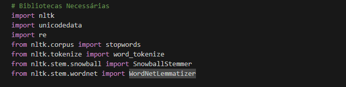
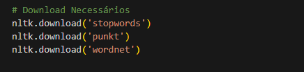
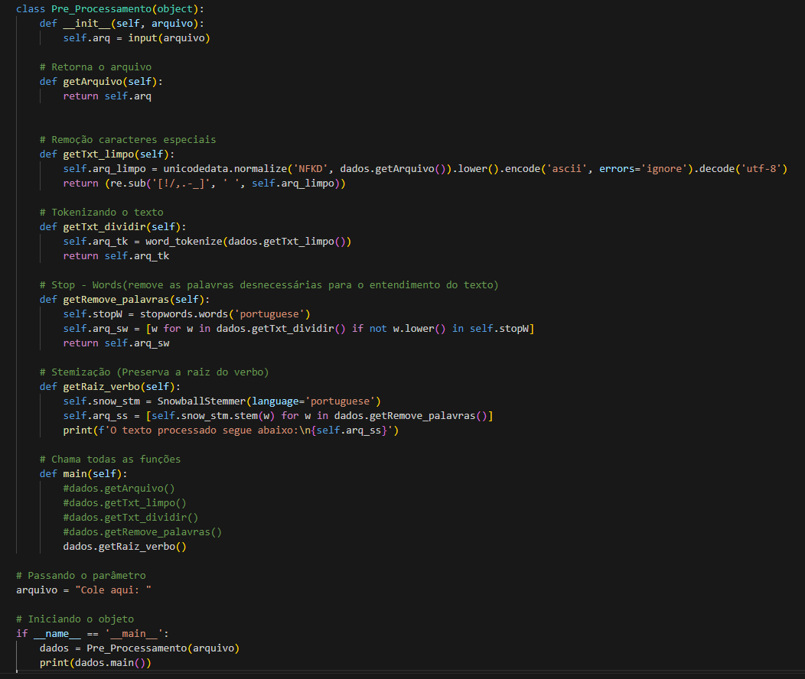

# Api_Flask_Textos
 Projeto Natural Language Toolkit (NLTK)

Código escrito no Jupyter Notebook:

#### Pré_Processamento de Textos:
- Realizado nesse projeto os seguintes passos:  
    - Criação do Objeto [ __Pré_Processamento__ ];
    - Função para remoção dos caracteres especiais, utilizando o métodos [ __*unicodedata.normalize*__];
    - A tokenização do texto será usado o método [ __*word_tokenize*__];
    - Para remover as palavras que não alteram o sentido do texto, usei o método [ __*stopwords.words*__];
    - Para 'pegar só o radical das palavras, utilizei o algoritmo [ __*SnowballStemmer*__].
- __OBJETIVO:__ - Facilitar o pré-processamento de textos ou palavras inicializando o objeto:

#### Criando o Objeto:
- Aqui serão criadas as funções para cada etapa do projeto.

#### Autor:
- __*Edcarlos Oliveira*__
- __GitHub:__ https://github.com/Edcarlos-Oliveira
